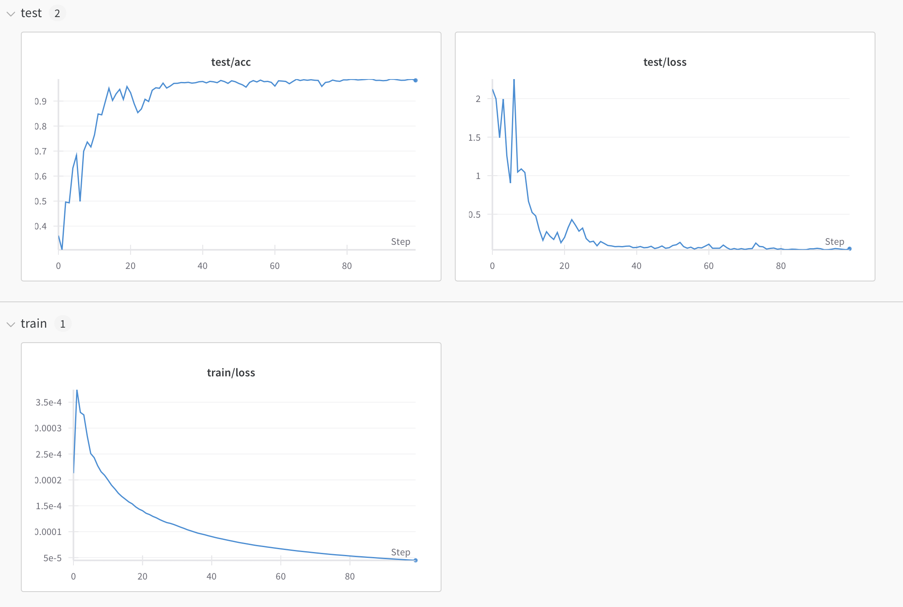

## 📅 Date
**01 December 2024**


## 📰 Resource
[Communication-Efficient Learning of Deep Networks from Decentralized Data](https://arxiv.org/pdf/1602.05629)


## 🔖 My Learning
Continuing the hands-on work on the `FedAvg` algorithm, started [yesterday](../day11/day11.md), today I implemented the main `FedAvg` class which call the `MNISTDataset`, `FederatedSampler` from `data` module and the `MLP`, `CNN` from the `models` module. Implemented the `Logger` class, designed to handle logging of training and evaluation metrics, particularly with the Weights and Biases (WandB) tool.

The goal of today was to make the library ready to train and test a model on the MNIST dataset in a Federated Learning setting using CLI commands to run the training and evaluation process. 

If you are courious please, try it out! The code is available [here](../day11/FedAvg/).

Running the following command will train a CNN model on the MNIST dataset in a Federated Learning setting with the following hyperparameters:  

`--batch_size=10 --frac=0.1 --lr=0.01 --n_client_epochs=20 --n_clients=100 --n_epochs=100 --non_iid=1 --wandb=True `

After 100 rounds of training, where each client performs 20 local epochs, the model reaches an accuracy of 98.5% on the test set. 
The communication cost is kept low, as the model is trained on a fraction of the data on each client.

```bash
Results after 100 rounds of training:
---> Avg Training Loss: 4.468076598908349e-05
---> Avg Test Loss: 0.05209210317078918 | Avg Test Accuracy: 0.9827
```


As we can see in the image, at already 15 rounds we overcome the accuracy value of 90% and we reach the stable accuracy of 97% at least in 30 rounds. Very few rounds! The computation rounds required are quite reduced using this algorithm that allows to train a model on a fraction of non-IID data on each client, without sharing the data to centralized serve. The key? The iterative epochs on each client and the aggregation of the model weights at the end of each round.

## 📮 Post 

[📘 LinkedIn Post](https://www.linkedin.com/posts/giuliagualtieri_30daysofflcode-fedavg-cnn-activity-7268906509764349953-VB1M?utm_source=share&utm_medium=member_desktop)

------
The _**Federated Learning Term of the Day**_ is **CNN**.
> [!NOTE]
>  CNN **(Convolutional Neural Network**) is a class of deep neural networks, most commonly applied to analyzing visual imagery. They are also known as ConvNets. CNNs are regularized versions of multilayer perceptrons. They consist of multiple layers of neurons, which have learnable weights and biases. Each neuron receives several inputs, takes a weighted sum over them, pass it through an activation function and responds with an output.