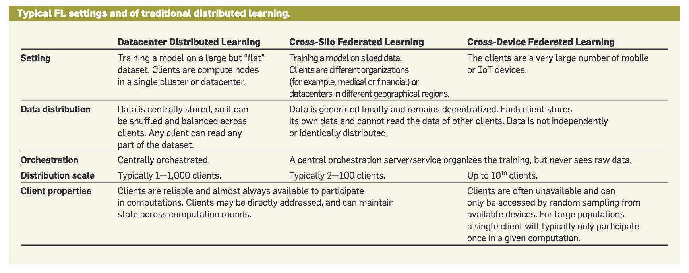

## 📅 Date
**3 December 2024**

## 📰 Resource
[Federated Learning and Privacy](https://dl.acm.org/doi/pdf/10.1145/3500240)

## 🔖 My Learning

### Federated Learning Settings and Applications
For a rewind of last concept studied yesterday, FL include keeping raw data decentralized and learning via aggregation. And this concept is something which we should be familiar with.

This assumption of locally generated data, often heterogeneous both in distribution and quantity (for better details read my blog posts about Day4 of the challenge, [2.3 Statistical Heterogeneity](day4/day4.md)), distinguishes FL from more typical **datacenter-based** distributed learning settings, where data can be arbitrarily distributed and shuffled, and any worker node in the computation can access any of the data. 

👮 The **role of a central server** is practically useful and often necessary, as in the case of mobile devices where a central server is necessary to mediate device-to-device communication. 
Moreover, the role of a central server constrains the space of relevant algorithms and helps to distinguish FL from more general forms of decentralized learning, including **peer-to-peer approaches**. 

From the basic definition, two FL settings have received particular attention: 

1️⃣ **Cross-device FL**, <ins>where the clients are large numbers</ins>(for example mobile or IoT devices). It's now used by both [Google](https://arxiv.org/pdf/1902.01046.pdf) and [Apple](https://arxiv.org/abs/2102.08503) for Android and iOS phones, respectively, for many applications such as mobile keyboard prediction. 

2️⃣ **Cross-silo FL**, <ins>where the clients are a typically smaller number of organizations, institutions, or other data silos</ins>. 
Cross-silo FA is being explored for problems such as health research (for example, Google Health Studiesa). 
Cross-silo FL has received considerable attention as well. Health and medical applications are a primary motivation, with significant investments from Nvidia, IBM, and Intel, as well as numerous startups. 
Another application that is on the rise is finance, with investments from WeBank, Credit Suisse, Intel, and others. 

The table in the image below, from [Kairouz et al.](https://arxiv.org/abs/1912.04977), summarizes the key characteristics of the FL settings and highlights some of the key differences between the **cross-device** and **cross-silo** settings, as well as contrasting with **datacenter distributed learning**. 
  

> [!TIP] 
> An interesting investigation could be this blog: https://blog.openmined.org/federated-learning-types/

### Algorithms for Cross-Device Federated Learning

[Communication-Efficient Learning of Deep Networks from Decentralized Data](https://arxiv.org/pdf/1602.05629) focused on establishing a proof of concept, this article introduced the **federated averaging algorithm**, as I detailed on [Day 6](../day6/day6.md), [Day 7](../day7/day7.md), [Day 11](../day11/day11.md) and [Day 12](../day12/day12.md) of my learning journey,
which continues to see widespread use, though many variations and improvements have since been proposed. The core idea builds on the classic **stochastic gradient descent** (**SGD**) algorithm, which is widely used for the training of ML models in more traditional settings.

☝️ **Recap**: The key idea of federated averaging is intuitive: decrease communication rounds, and so reducing the costs by taking multiple steps of SGD locally on each device, and then average the resulting models (or model updates) less frequently. 
> [!NOTE]
> If models are averaged after each local step, this reduces to SGD (and is probably too slow); if models are averaged too infrequently, they might diverge, and averaging could produce a worse model. 

Is there a sweet spot in between? Empirically, the [2017 paper](https://arxiv.org/pdf/1602.05629) showed the answer is yes. 
To see some results let's check the [Day12](../day12/day12.md) of the challenge, where I show the results of the hands-on work on the `FedAvg` algorithm.

This algorithm also demonstrates the key privacy point mentioned earlier, that model training can be reduced to the (repeated) application of a federated aggregation (the averaging of model gradients or updates).

**Developing 🖥️** an algorithm for FL is just the starting point. **Deploying FL 🚀** across devices in real-world applications requires several additional steps. 

Based on Google’s experience, the **WorkFlow** 🌀 typically involves:

1️⃣ **Identifying a Suitable Problem**: FL is ideal for tasks involving small to medium on-device models (1MB–50MB), where training data on devices is richer than datacenter data, privacy concerns prevent centralizing data, and feedback signals (labels) can be generated on-device (e.g., next-word prediction).  

2️⃣ **Model Development and Evaluation**:
Start by tuning the model architecture and hyperparameters (e.g., learning rates, batch sizes) using a simulation with proxy data in the datacenter.
Perform final tuning and evaluation on real devices, as simulations can’t fully capture real-world data distributions and device characteristics.
Federated evaluation involves sending the global model to held-out devices for local testing and aggregating results on the server.
Key infrastructure requirements include high-performance FL simulation and a cross-device system for managing multiple training and evaluation tasks.  

3️⃣ **Deployment**: After selecting a high-quality model, deploy it using standard procedures like additional validation, live A/B testing, and staged rollouts to the full fleet.
FL-trained models don’t affect user experience unless explicitly deployed. To avoid impacting devices negatively, computations are typically run only when devices are idle, plugged in, and connected to Wi-Fi.

Building scalable infrastructure and developer-friendly APIs to support these workflows is a significant challenge, as outlined by [Bonawitz et al. (2019)](https://arxiv.org/pdf/1902.01046).

So Today was a day with really a lot of new concepts and interesting open point of investigations for the next steps of my learning journey. Howevere, it's not enede here the study on the resource pinned today.

### ✨ What's Next?
- **Data Minimization for Aggregation**.
- **Federated Analytics**.

## 📮 Post 

[📘 LinkedIn Post](https://www.linkedin.com/posts/giuliagualtieri_30daysofflcode-activity-7269633809661243392-VxwH?utm_source=share&utm_medium=member_desktop)

------
The _**Federated Learning Term of the Day**_ is **Cross-Device Federated Learning**.
> [!NOTE]
> **Cross-Device Federated Learning** refers to the machine learning setting where multiple mobile and edge devices collaborate in solving a machine learning problem. Up to 10^10. Clients are often unavailable and can only be accessed by random sampling from available devices. For large populations a single client will typically only participate once in a given computation.
