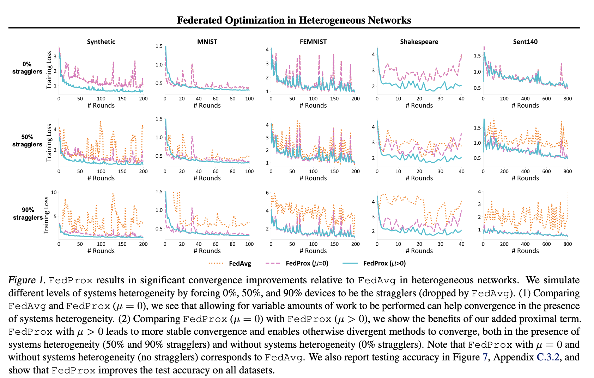
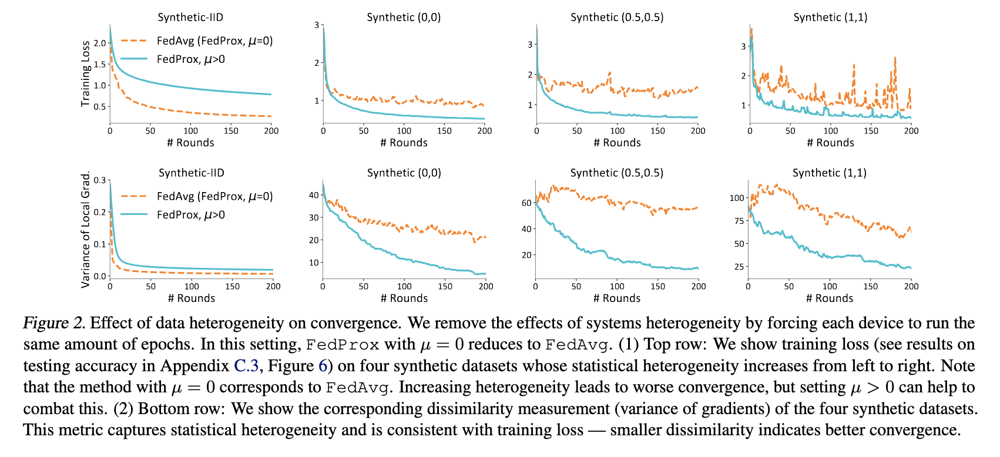

## 📅 Date
**9 December 2024**

## 📰 Resource
[FEDERATED OPTIMIZATION IN HETEROGENEOUS NETWORKS](https://arxiv.org/pdf/1812.06127)

## 🔖 My Learning

Today I dove into reading the experiments and results of the FedProx algorithm.

### FedProx: EXPERIMENTS
The article presents empirical results for the generalized `FedProx` framework. 

1. They demonstrate the improved performance of FedProx tolerating partial solutions in the face of systems heterogeneity. They simulate systems heterogeneity by assigning different amounts of local work to different devices.

2. They the effectiveness of FedProx in the settings with statistical heterogeneity (regardless of systems heterogeneity). In order to better characterize statistical heterogeneity and study its effect on convergence, they also evaluate on a set of synthetic data, which allows for more precise manipulation of statistical heterogeneity.

🌟 _**Discover**_!: [**FEMNIST**](https://paperswithcode.com/dataset/femnist) : a 62-class Federated Extended MNIST ([Cohen et al., 2017](https://paperswithcode.com/dataset/femnist); [Caldas et al., 2018](https://arxiv.org/pdf/1812.01097)).

3. They also studied the effects of statistical heterogeneity on convergence and show how empirical convergence is related to the theoretical bounded dissimilarity assumption (Assumption of Bounded dissimalirity) 

.

- **Tolerating Partial Work**
  **How**: `FedAvg` consider only devices that compute all the fixed number of epochs. `FedProx` allows for devices to compute a variable number of epochs.
  **When**: Systems Heterogeneity.
  **What**: The convergence is still guaranteed.

.

- **Proximal Term**
  **How**: Setting μ > 0 is particularly useful in heterogeneous settings. This indicates that the modified subproblem introduced in `FedProx` can benefit practical federated settings with varying statistical heterogeneity.
  **When**: Statistical Heterogeneity.
  **What**: The convergence is still guaranteed.

🚀 _**Amazing news**_: all code, data, and experiments are publicly available at: https://github.com/litian96/FedProx !

- **Choosing μ** One natural question is to determine how to set the penalty constant `μ` in the proximal term. A large `μ` may potentially slow the convergence by forcing the updates to be close to the starting point, while a small μ may not make any difference. In all experiments, They tune the best μ from the limited candidate set {0.001, 0.01, 0.1, 1}. 

While automatically tuning `μ` is difficult to instantiate directly from our theoretical results, in practice, we note that `μ` can be adaptively chosen based on the current performance of the model. For example, one simple heuristic is to increase `μ` when seeing
the loss increasing and decreasing `μ` when seeing the loss decreasing. They demonstrate the effectiveness of this heuristic using two synthetic datasets. Note that we start from initial `μ` values that are adversarial to our methods.

### Dissimilarity Measurement and Divergence
The Experiment section of the article show that they measured and tracked the values of the **B-local dissimilarity** , showing that it captures the heterogeneity of datasets and is therefore an appropriate solution for convergence achievement. 

In particular, they track the variance of gradients on each device, `Ek[‖∇Fk(w)−∇f (w)‖2]`, which is lower bounded by `Beps`. 

Empirically, they observed that increasing `μ` (coefficient of the l2-norm of the difference between local updates and gloabl updates in the **proximal term**) leads to smaller dissimilarity among local functions `Fk`, and that the dissimilarity metric is consistent with the training loss. Therefore, smaller dissimilarity indicates better convergence, which can be enforced by setting `μ` appropriately. 

They also show the dissimilarity metric on real federated data, and I leave it for the readers of the entire original article.

### Conclusion
Here's the main takeaways from the new optimization framework proposed in the article `FedProx`:
  
- The framework is able to handle the systems and statistical heterogeneity inherent in federated networks. Moreover, it allows for variable amounts of work to be performed locally across devices, and relies on a proximal term to help stabilize the method. 

- The convergence guarantees are provided in realistic federated settings under a device dissimilarity assumption, while also accounting for practical issues such as stragglers. 

- The empirical evaluation across a suite of federated datasets has provided and it validates the theoretical analysis and demonstrates that the `FedProx` framework can significantly improve the convergence behavior of federated learning in realistic heterogeneous networks.

### Code
Available Implementation of the algorithm : https://flower.ai/docs/baselines/fedprox.html. So this time, I'm not going to implement it from scratch, but I will use the available implementation to run some experiments.

## 📮 Post 

[📘 LinkedIn Post]()

The _**Federated Learning Term of the Day**_ is **Dissimilarity Measure**.
> [!NOTE]
> Generalizing the **Dissimilarity Measure** to the context of any two objects (functions depending on parameters), it represents a measure able to quantify the distance between the two objects using the theories of measure, integration, and probability of dimensional spaces.
