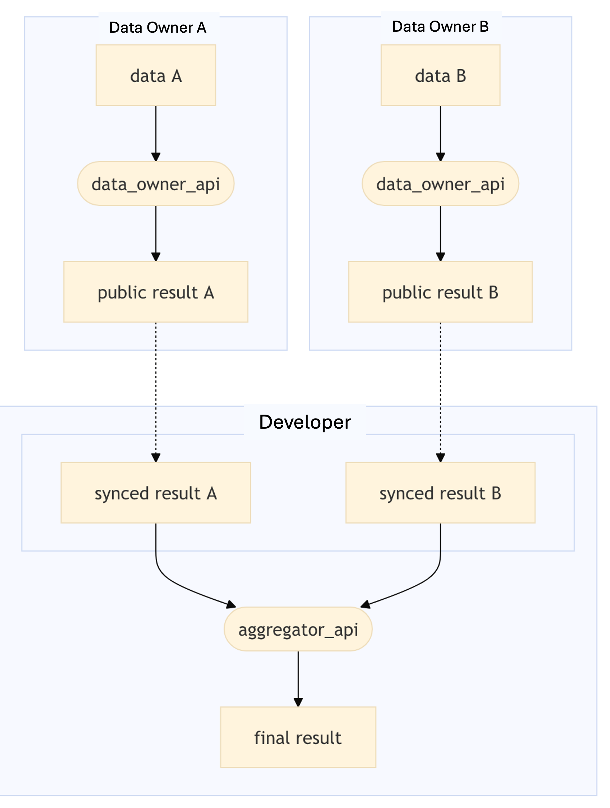

## 📅 Date
**12 December 2024**

## 📰 Resource
[SyftBox Computation Model](https://syftbox-documentation.openmined.org/tutorials/computation-model)

## 🔖 My Learning
Today I dove into how you can install an API on your SyftBox and start being part of a computation. 

Once installed [SyftBox](https://syftbox-documentation.openmined.org/), you'll find a `SyftBox` folder on your system. Inside this folder, the most important two main components are `APIs` and `Datasites`.

> [!NOTE]
> **`APIs`** allow you to propose and participate in computations within SyftBox. **`Datasites`**, on the other hand, represent individual entities in the Syft network - individuals, organizations, etc and contain their private and public data.

### Workflow overview

Applying computations on private data works through a workflow that implies 2 parties:
1. **Data Owners** -> the party that owns part of the private data taking part in the computation
2. **API Developer** -> the party that wants to apply the computation on the private data.

Since the **API developer** is the one proposing the study, they will be in charge of writing both the API designed to run on the data owner's Datasite (preparing the data for aggregation) and the API designed to run on their Datasite.

🔹 **Data owner setup**  

A data owner takes part in a computation by installing a SyftBox API following a developer's proposal. The Data Owner API is designed to apply a computation on the private data on their Datasite and write a publicly available result.

🔹 **Developer setup**

A developer will install another API on their own datasite, which will aggregate the public results computed on the Data Owner's Datasites.

🔹 **Step by step**

The whole workflow looks something like this:


1. **data owners (A and B)** each prepare their private data (CSV, JSON, or any other format supported by the APIs)
2.  **data owners (A and B)** each install the data_owner_api API on their Datasites (developed by the API developer)
3. the **developer** installs the aggregator_api API on their Datasite.
4. the **developer** will soon see the aggregation result on their Datasite.

That's it! SyftBox takes care of syncing the intermediary public results between datasites so the APIs can do their job.

> [!NOTE]
> For this workflow to work, every party needs to have their client running and connected to the same Syft network.

### Example: CPU Tracker API
The **CPU Tracker API** is a simple example of what could be build on **SyftBox**: it's an application that gathers CPU data from participating Datasites and displays them in a chart after aggregating them.

[Click here](https://syftbox.openmined.org/datasites/aggregator@openmined.org/) to see a live example of the CPU Tracker API running on the main Syft network.

🔹 **Installation**

To install the CPU Tracker, follow these steps:
- Make sure your SyftBox client is running
- Download the API: 
```bash
git clone https://github.com/OpenMined/cpu_tracker_member
```
this repo and move the cpu_tracker_member folder to your syftbox/apis folder.
```bash
mv -r ./cpu_tracker_member <SYFTBOX_DATADIR>/apis/  # default: ~/SyftBox
```

That's it! We are now part of you're now part of the computation! Out=r CPU load will be included in the aggregation, helping to calculate the average CPU load across the Syft network. Ours Datasite will appear in the "Active Peers" list participating in the computation.

## 📮 Post 

[📘 LinkedIn Post]()

------
The _**Federated Learning Term of the Day**_ is **Workflow**.
> [!NOTE]
> Workflow is a series of tasks that produce a specific service or product. In the context of federated learning, it refers to the sequence of steps that need to be taken on private data.
