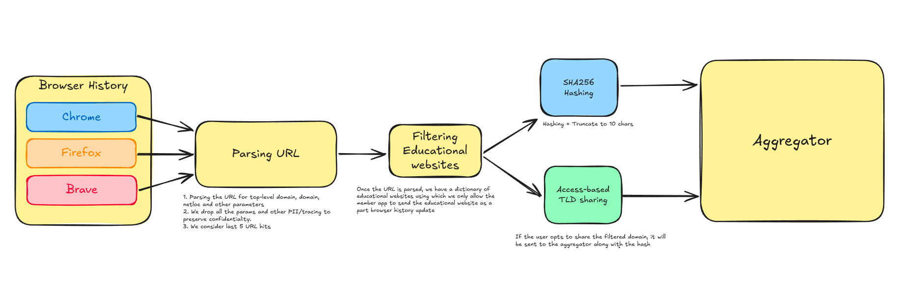

## 📅 Date
**13 December 2024**

## 📰 Resource
[SyftBox](https://syftbox-documentation.openmined.org/) library.

## 🔖 My Learning

Today, with my fellows [Irina](https://github.com/IrinaMBejan), [Gustavo](https://github.com/gubertoli) and [Vivek](https://github.com/VivekSil), as part of the challenge #30DaysOfFLCode like me, we had the honor to present our project for the Challenge 30DaysOfFLCode at the "Show & Tell" of OpenMined. 

As anticipated on my past days, we developed a "Federated Browser History Analyser" 🚀

### ### Federated Browser History Analyser
💻 OpenSource code:
👉 browser_history_member https://github.com/VivekSil/browser_history_member
👉 browser_history_aggregator https://github.com/IrinaMBejan/browser_history_aggregator?tab=readme-ov-file

### The Project
The project provides tools for analyzing, classifying, and comparing browser history data, focusing on privacy and educational content. It integrates privacy-preserving techniques and classification methods to manage browser history data securely.
browser_history_member         |  browser_history_aggregator | 
:-------------------------:|:-------------------------:|
  |  |  

It could be installed through the SyftBox library as an API and used in this friendly FL environtment as a client.

### Features
The aggregated results are:
- Up to date Most Used Learning Resources
- Interactive Find Your Learning Mate feature
- Top Research Papers (directly readable and downloadable from the website)

### WorkFlow 
The summary of the workflow of our project within the SyftBox FL structure is as follows:
1️⃣ The browser_history_member app writes intermediary outputs to a folder where only the client and the aggregator has access.
2️⃣ The aggregator app, browser_history_aggregator, computes the final results and write them to a file where they can be used by the static website. Only one person needs to run this app!
3️⃣ A static website reads the final results file and renders the view like here 🤩 https://syftbox.openmined.org/datasites/irina@openmined.org/browser_history_agg/

We encourage all of you to install the browser_history_member app and partecipate as a client! then, Find Your Learning Mate!!! ✨ Get in touch with him and start learning together!

### Next Steps
- [ ] develop a recommendation system based on browsing history.
- [ ] implement advanced privacy-preserving techniques to ensure data security (as encryption of browser history, dp for best mates)
- [ ] OS versatility and support: making the APP working also on linux and windows

## 📮 Post 

[📘 LinkedIn Post](https://www.linkedin.com/posts/giuliagualtieri_30daysofflcode-30daysofflcode-opensource-activity-7273414628926201856-Da52?utm_source=share&utm_medium=member_desktop)

------
The _**Federated Learning Term of the Day**_ is **Federated Learning for Browser History Analysis**.
> [!NOTE]
> Our project of Federated Learning for Browser History Analysis is a federated learning solution that allows multiple clients to analyze their browser history data without sharing it with a central server.