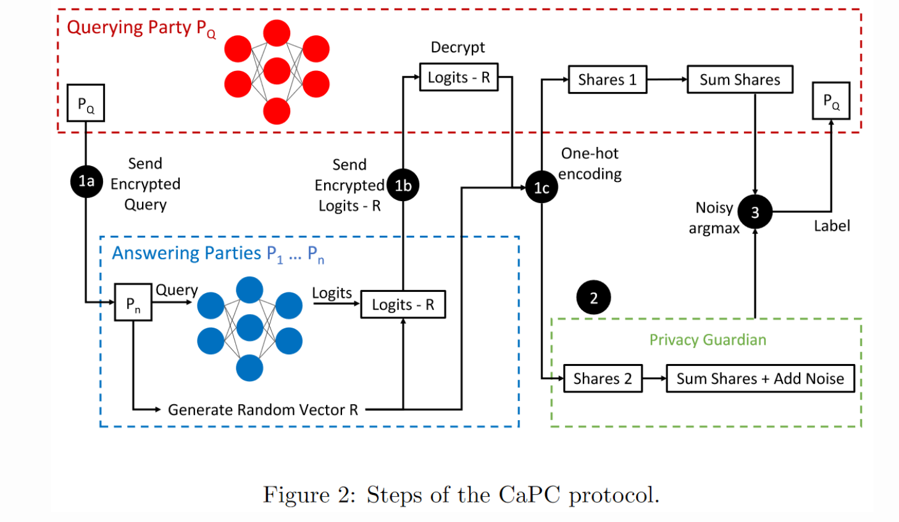

## 📅 Date
**16 December 2024**

## 📰 Resource
[Beyond federation: collaborating in ML with confidentiality and privacy](http://www.cleverhans.io/2021/05/01/capc.html) (May 1, 2021).

## 🔖 My Learning

In machine learning, it is frequent to obtain better predictions by collaboratively polling the predictions of multiple machine learning models (a technique often known as ensemble learning). For instance, collaboration can help improve a model’s performance by increasing the amount of training data available.

*The CaPC control*, where **CaPC** stands for Confidential and Private Collaborative Learning, is a protocol for enabling machine learning models to collaborate while preserving the privacy of the underlying data.

This innovative algorithm enables to have an ensemble of distributed models collaboratively predict on an input without ever having to reveal this input, the models themselves, or the data that they were trained on.

**Confidentiality** of the data and models is maintained if data is never accessed in its raw form, i.e., the data is encrypted using some cryptographic method rather than transmitted in plaintext. This prevents models in the ensemble from reading the input they are predicting on. It also means it's not required to centralize all of the models in a single location, so these models’ confidentiality (parameter values, architectures, etc.) is also preserved.

**Privacy** of the data is often reasoned about using the differential privacy framework, which protects the privacy of individuals by guaranteeing that their training record won’t overly influence the outcome of the analysis. 

CaPC integrates building blocks from cryptography and differential privacy to provide **Confidential and Private Collaborative** learning.

### TLDR
The CaPC protocol finalizes with the aggregate label returned to the querying party. To protect privacy (in the sense of differential privacy), the protocol does not reveal the individual predictions of each model. A voting mechanism is there, it returns the aggregated prediction. Each answering party will vote on a label for the input data point, resulting in a histogram of votes, and the class with the most votes will be the returned label. However, this naive voting mechanism can still leak information about the training data which each answering party used to learn their own model. To prevent and protect privacy in a differential privacy sense, **it's not required to add some (random) noise to the histogram before the ensemble learning return the highest voted label**.

### Mechanism

1. The protocol begins when any party (e.g., the cardiac hospital) has unlabeled data. That party acts as the querying party. The querying party encrypts their data using Homomorphic Encryption. 
2. Then, the querying party sends their homomorphically encrypted data to all the answering parties (the ensemble).
3. Each answering party labels this data point with its own machine learning model. 
In particular, Each answering party uses its machine learning model to perform private inference on the encrypted data, producing logits (unnormalized predictions for each class).
4. To prevent differential privacy leakage, each answering party will secret share their logits with the querying party by subtracting a random vector R from them before sending. This acts as a form of encryption preventing the querying party from gaining plaintext access to the logits before PATE.
5. The querying party receives the masked logits (logits minus R).
6. Through a 2-Party Computation (2PC) protocol:
   - The querying party and each answering party compute the one-hot encoding of the logits (a binary vector with 1 only at the index of the predicted class) without either party accessing the logits in plaintext.
   - The querying party and each answering party each receive a share of the one-hot encoding (i.e., a secret-shared representation of the one-hot vector).
7. The answering parties send their shares of the one-hot encoding to an independent entity called the Privacy Guardian (PG). Simultaneously, the querying party keeps its own shares of the one-hot encoding.
8. The Privacy Guardian:
- Sums the shares received from the answering parties.
- Adds random noise to the summed result to ensure differential privacy using the PATE (Private Aggregation of Teacher Ensembles) framework.
- This produces a differentially private representation of the aggregated predictions.
9. Finally, through another 2PC protocol, the Privacy Guardian and the querying party combine their respective summed shares:
- This process removes the secret sharing, yielding the final noisy prediction in plaintext.
- The result is the differentially private label, which reflects the consensus of the answering parties’ predictions while preserving privacy.

### PETs Tools
- **Homomorphic encryption (HE)**
- **Secret sharing**
- **2-Party Computation (2PC)**
- **Privacy Guardian**
- **Private Aggregation of Teacher Ensembles (PATE)**
- **Differential Privacy (DP)**

> [!NOTE]
> **Homomorphic encryption** is a special type of encryption that enables linear arithmetic on the data, e.g., encrypting a data point, then adding 5, and unencrypting will yield the original data plus 5 (the same property holds for multiplication). As we will see, this is an important property that CaPC relies on that most forms of encryption do not provide. It allows the answering parties to predict on the encrypted input without decrypting it first.

### PROs
**CaPC** affords much greater flexibility in terms of:
- the number of participants, 
- model architecture heterogeneity, and 
- security assumptions made by the protocol participants. 

### CONs
Improving CaPC:
- **quite complex** mechanism, which leads to new possible leakage points. IMO increasing the number of complexity could also increase the number of possible leakage and breaking points of the entire protocol.
- **quite slow**,due to the performing private inference with each answering party is by far the slowest component of the protocol.

## 📮 Post 

[📘 LinkedIn Post]()

------
The _**Federated Learning Term of the Day**_ is **Secret sharing**.
> [!NOTE]
> Secret sharing is a method for distributing a secret among a group of participants, each of whom is allocated a share of the secret. The secret can be reconstructed only when a sufficient number of shares are combined together; individual shares convey no information about the secret.