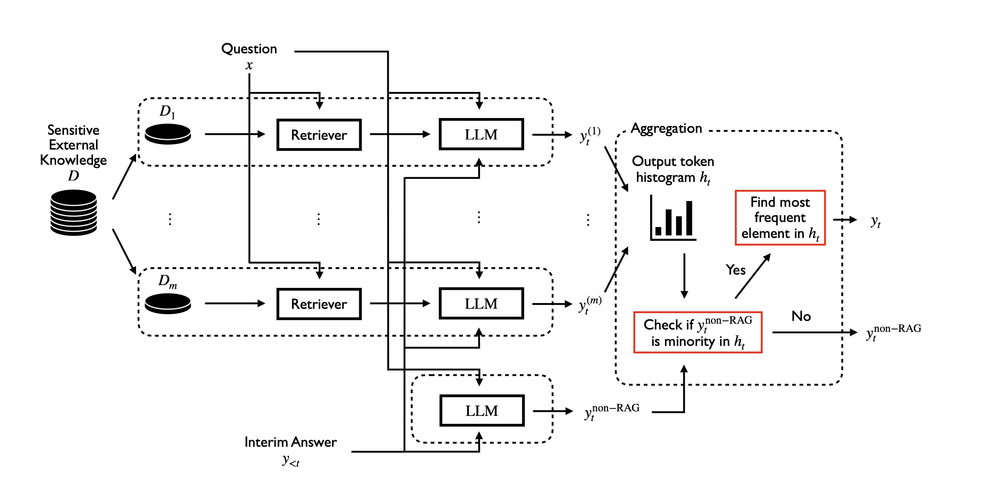
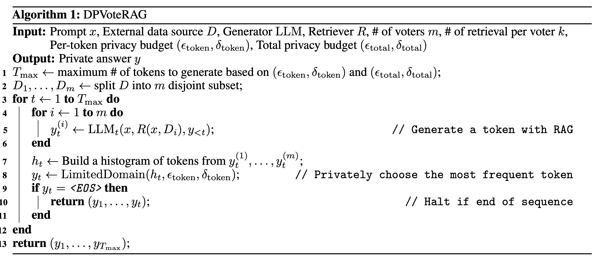

## 📅 Date
**17 December 2024**

## 📰 Resource
[PRIVACY-PRESERVING RETRIEVAL AUGMENTED GENERATION WITH DIFFERENTIAL PRIVACY](https://arxiv.org/pdf/2412.04697)

## 🔖 My Learning
As a DP passionate, today, I've explored RAG under differential privacy (DP).

For the today summary, I requesite of a base knowledge of Differential Privacy. Sorry
 
### Problem Setting
Retrieval augmented generation (RAG) assists LLMs by directly providing relevant information from the external knowledge sources. However, without extra privacy safeguards, RAG outputs risk leaking sensitive information from the external data source.

### Goal
The goal is to prevent the information leakage of the sensitive external corpus by designing a **privacy-preserving RAG system**.
In particular the aim is to generate an LLM answer to a prompt x with retrieved external knowledge, Dx = R(x, D), from a sensitive data source D with differential privacy guarantee.

### Algorithm Overview
The proposed algorithm smartly spends privacy budget only for the tokens that require the sensitive information and uses the non-private LLM for other tokens.

### Challenges & Solutions
There are two aspects of challenges with designing an effective RAG algorithm under DP. 

1️⃣ the first is how to fit differential privacy into the RAG framework (They address the first challenge by proposing an algorithm, `DPVoteRAG`, based on the [*sample-and-aggregate framework in DP*](https://dl.acm.org/doi/10.1145/1250790.1250803).) 

2️⃣ the second is how to manage the privacy-utility tradeoffs. 

### Retrieval Augmented Generation with Large Language Model
RAG: **a retriever finds relevant documents from the external data source**. 

Retrieval augmented generation (RAG) is a technique to improve the performance of large language models (LLMs) on knowledge-intensive tasks by providing external knowledge. Given a question prompt. Then, the relevant documents are added to the prompt as the contexts. An LLM (or generator) takes the augmented prompt as input and outputs the answer

### HP
Let the sensitive data source D be a collection of individuals’ records, where one record corresponds to one individual’s sensitive data.

### Differentially Private Generation via Sample-and-Aggregate
To generate a single token, a set of LLMs, each depending on a disjoint subset of the sensitive dataset D, generates a token or a probability distribution of a token respectively. When a set of tokens is generated, it forms an aggregate histogram of tokens, which is then carefully randomized with noise. That set of probability distribution forms a mixture of probability distribution satisfying differential privacy. Then, only the most frequent token in the noisy histogram is published as the final output. The repetition of this process along with the composition theorem of DP yields the differentially private token sequence generation.

### Differentially Private Retrieval Augmented Generation with Sparse Vector Technique
Our differentially private RAG algorithm consists of two main components:
1️⃣  DP voting for the single-token generation
2️⃣  efficient privacy budget spending by leveraging the sparse vector technique combined with the utilization of LLMs without any relevant documents provided. 

The graphical overview of our algorithm is presented in Figure below.

### DPVoteRAG
Given a prompt x and external data source D, DPVoteRAG first partitions D into m disjoint datasets D1,...,Dm..

For each i = 1, . . . , m, the RAG retrieves k relevant documents from Di, feeds them into the LLM along with the original prompt x, and generates a next token. 

It collects these tokens to form a histogram over the vocabulary. 

It privately chooses the most frequent element from the histogram. While it is generally hard to do so when the histogram dimension is large as in our setting, e.g., the vocabulary size is 50272, there is a line of work in the community to overcome this difficulty. 

They integrate the **LimitedDomain mechanism** into the algorithm. The mechanism enables to reduce the histogram dimension significantly with some cost in privacy budget and thus achieve a better privacy-utility tradeoff. By its design, the **LimitedDomain mechanism** possibly outputs the designed null token. In such a case, they halt the algorithm, or equivalently, regard that it outputs the end of sequence token. 

Finally, they append the chosen token to the next input to the LLM. 

This process is repeated until the algorithm reaches the end of sequence token chosen or reach the maximum number of token generation, which is computed in advance from the per-token and total privacy budget. 

### DPSparseVoteRAG: Differentially Private Voting Algorithm for RAG with Sparse Vector Technique
The main drawback of the aforementioned algorithm is that it needs to spend a non-negligible amount of privacy budget for each token to guarantee its quality. This prevents our algorithm to generate longer answers—sometimes it can halt before it generates the actual answers due to privacy budget shortage. 

The step from DPVoteRAG to DPSparseVoteRAG is simple and genial, from my pov.

In particular, they always apply private voting among generated tokens, but they check if the generated tokens coincide with the token generated by the LLM without retrieved documents appended, i.e., the input is composed of the prompt and previously generated tokens only. If it's so no privacy budget has been spent, as they used the LLM output without retrieved documents. 

The aglorithm uses privacy budget when the tokens are differents with non-RAG LLM. 
The algorithm continues to the voting only when they do not coincide. 

The consumed privacy budget scales with the number of times that it uses the private voting, not with the total number of generated tokens. 
Consequently, the resulting algorithm enables us to spend privacy budget only when it needs sensitive information.

### Experiments and Results
**Comparison of algorithms**: They observe that:
- DPSparseVoteRAG outperforms Non-RAG mostly under εtotal ≥ 10 when VoteRAG is better than Non-RAG, i.e. when VoteRAG is better than Non-RAG.
- DPVoteRAG requires larger total privacy budget to outperform Non-RAG or can even perform worse than Non-RAG
- DPSparseVoteRAG always yields better results than DPVoteRAG. This suggests the importance of the smart privacy budget usage offered by DPSparseVoteRAG.

**Effects of hyperparameters**: they discovered that:
- For a tight total privacy budget, large εtoken allows our algorithms to only output a few meaningful tokens; thus, smaller εtoken is preferable.
- Conversely, under a large total privacy budget, accurate token generation with large εtoken is more important than having more tokens generated with small εtoken. The main difference between two of our algorithms in terms of εtoken is that DPSparseVoteRAG generally allows us to set larger εtoken than DPVoteRAG under a fixed total privacy budget. More specifically, while setting εtoken = 2 yields the best utility for DPVoteRAG even under εtotal = 40, DPSparseVoteRAG performs the best with εtoken = 5. This demonstrates the benefit of DPSparseVoteRAG to save and spend privacy budget cleverly—it can spend the saved privacy budget for generating important tokens for answering questions correctly.
- With regard to the number of voters m for DPVoteRAG, we generally see that having more voters results in better utility with εtoken = 1. On the other hand, with larger εtoken, the number of voters has less effect on the utility and having less voters provides slightly better utility. The observation holds for all values of εtotal. 

**DPSparseVoteRAG algorithms boost the QA accuracy even under a formal privacy guarantee**: the DPSparseVoteRAG algorithms improves the utility of question-answering tasks over the non-RAG baseline by exploiting the external knowledge through RAG while ensuring a reasonable level of privacy εtotal = 10.

**DPSparseVoteRAG is strictly better than DPVoteRAG**. 

**εtoken should allow medium-length outputs. m should balance the DP noise and # of well-informed voters**: The per-token privacy budget, εtoken, should be small enough to allow the algorithms to generate a reasonably large number of tokens (∼ 10). As far as the resulting sequence is long enough, we should certainly make it as large as possible to enable accurate token generations. Furthermore, the number of voters, m, should be set by considering per-token generation quality. For a strict per-token privacy budget, e.g., εtoken = 1, it needs to be large enough to relax the impact of the DP noise to the vote result histogram. For larger per-token privacy budgets, it should be small enough to ensure the majority of the voters receives useful external documents as the context.

### Drawbacks
- it's still no private from **model breaching** attack, as the RAG see in clear and directly the raw data with sensitive information
- the algorithm has **maximum number of token generation**, which is computed in advance from the per-token and total privacy budget. 
- there is a **risk of having voters with irrelevant documents** who can vote for wrong tokens.
- lack of evaluations that are as close to the **real situation**.
- it requires multiple instances of a RAG pipeline in parallel to do the token-by-token aggregation and voting for DP, so it represents a contraints for **real-time generation**.

## 📮 Post 

[📘 LinkedIn Post]()

------
The _**Federated Learning Term of the Day**_ is **sample-and-aggregate**.
> [!NOTE]
> **Sample-and-aggregate** is a popular method for ensuring differential privacy of a classifier. It consists in dividing the dataset into distinct chunks and a model is learned on each chunk, after which it is aggregated.
