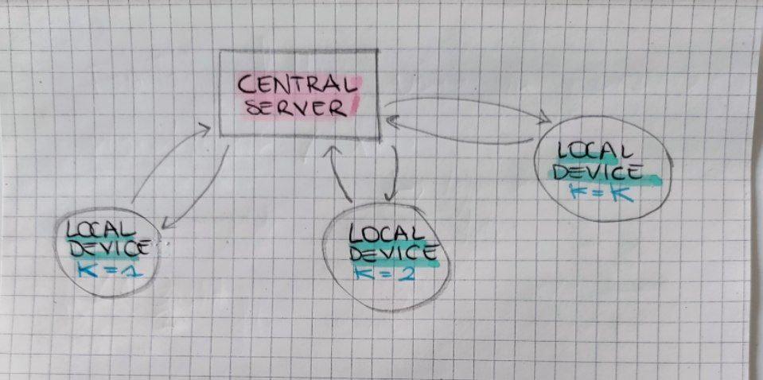

## 📅 Date
**25 November 2024**

## 📰 Resource
[Communication-Efficient Learning of Deep Networks from Decentralized Data: Abstract, Introduction, FederatedAveraging algorithm](https://arxiv.org/pdf/1602.05629)

## 🔖 My Learning
Early this morning, I started reading the article about the **Federated Averaging algorithm**, one of the workhorses of Federated Learning methods.

Considering my drawing in [Figure 1: Federated Networks](https://github.com/GiuliaGualtieri/30DaysOfFLCode/raw/main/30days/images/FederatedNetworks.jpeg)) where we have a a _central server_ and different _local devices_ (that we could call also clients), the `FedAvg` algorithm combines local stochastic gradient descent (SGD) on each client with a server that performs model averaging, which is why 'average' in the name of the algorithm. 

It has been developed as a practical method for federated learning of deep networks. How do they get to the `FedAvg` algorithm?! 
The recent multitude of successful applications of deep learning have almost exclusively relied on variants of stochastic gradient descent (SGD) for optimization; thus, it is natural that the algorithm for training a deep neural networks in federated newtorks would have been built by starting from SGD as well.

Here's the process of development of the final `FedAvg`. I write for who has already familiar with SGD and deep learning models.
1️⃣ First idea was SGD applied naively to the federated networks, considerng each client as a possible element in the batch, so at each batch iteration sampling a random number of clients. Unfortunately, approach requires very large numbers of rounds of training to produce good models.
2️⃣ Second approach of integrate SGD in a federated network was to implement a **large-batch synchronous SGD**, which could be considered the baseline `FedSGD`. At each communication round a full-batch (non-stochastic) gradient descent is computed. Full-batch in the sense that you consider all the clients, and so you ask to all the clients to compute local model updates and then average them out to get the global model updates of the gradient parameters. Here, each client locally takes one step of gradient descent on the current model using its local data, and the server then takes a weighted average of the resulting models. However this is not enough strong when data are non-IID. 
3️⃣ So during each communication round in each client a number of iterations of local updates (through SGD) has been implemented.

Below you can find my notes and my drawings of the algorithm, which highlight the major parametric characteristics of 
`FedAvg`, compared to a general standard federated learning algorithm using stochastic gradient descent (SGD), referred as `FedSGD`, for parameter updates.

Federated Network| 
:-------------------------:|

**Setting**: 
- The learning task is solved by a federation of participating _local devices_ (called also clients) which are coordinated by a _central server_ (see [Figure 1: Federated Networks](https://github.com/GiuliaGualtieri/30DaysOfFLCode/raw/main/30days/images/FederatedNetworks.jpeg)).
- We assume a synchronous update scheme that proceeds in rounds of communication, `t` = round in figures below.
- There is a fixed set of `K` clients, each with a fixed local dataset. 
- At the end of each round we only select a fraction of clients thet effectively ended local updates computation. (see [Figure 2: `Federated SGD algorithm`](https://github.com/GiuliaGualtieri/30DaysOfFLCode/raw/main/30days/images/FedSGD.jpeg), row 5, [Figure 3: `Federated Averaging algorithm`](https://github.com/GiuliaGualtieri/30DaysOfFLCode/raw/main/30days/images/FedAVG.jpeg), row 7)
- Fixed learning rate `η`.
> [!NOTE]
> - `C`, the fraction of clients that perform computation on each round. At the beginning of each round, a random fraction `C` of clients is selected, and the server sends the current global algorithm state to each of these clients (e.g., the current model parameters).
> - `E`, then number of training passes each client makes over its local dataset on each round
> - `B`, the local minibatch size used for the client updates

FedSGD algorithm             |  FedAvg algorithm
:-------------------------:|:-------------------------:
  |  
 

If:
- `C = 1` corresponding to full-batch (non-stochastic) gradient descent
- `B = inf`
- `E = 1`
then `FedAVG` --> `FedSGD`.

## 📮 Post 

[📘 LinkedIn Post]()

------
The _**Federated Learning Term of the Day**_ is **FederatedSGD**.
> [!NOTE]
> Each selected client performs local computation based on the global state and its local dataset, and sends an update to the server. The server then applies these updates to its global state, and the process repeats until convergence is reached.
