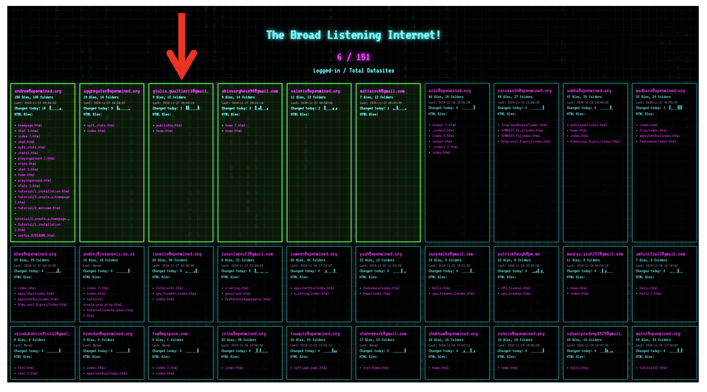

## 📅 Date
**27 November 2024**

## 📰 Resource
[SyftBox](https://syftbox-documentation.openmined.org/) library.

## 🔖 My Learning
During my first **Federated Learning Hackaton**, sponsored by **OpenMined**, on `24th October 2024`, I discovered for the first time the **SyftBox** library.

### ❓ What is SyftBox?

SyftBox is an innovative project by [OpenMined](https://openmined.org/) that aims to make privacy-enhancing technologies (PETs) more accessible and user-friendly for developers. It provides a modular and intuitive framework for building PETs applications with minimal barriers, regardless of the programming language or environment.

### 🔍 Where I can find SyftBox?

It's available on [pypi.org](https://pypi.org/project/syftbox/):  `pip install syftbox` .

Last Release **0.2.1** : on 26 Nov. 2024 → you will see it's at least weekly updated.

First release **0.1.0** : on 8 Oct. 2024, https://pypi.org/project/syftbox/0.1.0/

Recently they have published a detailed documentation → https://syftbox-documentation.openmined.org/

### ⚙️ How I can use SyftBox?

#### Requirements

- `curl`
- your `email` representing yourself as a local client in the federated networks.
- `Linux`, `MacOs` (works fine), `Windows` (recently released, so maybe some troubles can still be there.)
- `python 3.12` (recommended from my experience)

#### Automatic Installation

- `uv` as env manager and pretty python manager.
- creation of an environment `./venv`, that you can activate directly by `source ./venv/bin/activate`

#### Installation

Running the install command:

`curl -LsSf https://syftbox.openmined.org/install.sh | sh`

To keep your terminal open to keep the client running. 

To restart the client, simply run the install command again.

#### My Experience

After connecting your client to the Syft network, check out the [***Stats Dashboard***](https://syftbox.openmined.org/datasites/aggregator@openmined.org/syft_stats.html), where you can see a list of *all* connected Datasites and their public files! 

Where I was able to see mine! 🙂

### ✨ Key Features

In my opinion here's the key features of the library:

1. **Suited for Federated Learning application**: It consists in a network-first architecture. It creates a seamless web of interconnected nodes called **Datasites**, ensuring an efficient data distribution and collaboration naturally suited for **Federated Learning** applications.
2. **Language and Environment Agnostic**: SyftBox is designed to be language and environment agnostic, allowing developers to use their preferred programming languages and tools.
3. **Allow to create APIs**: SyftBox allows to install and create your own APIs, designed to interact with data that are either private to a single Datasite or synced from other Datasites. How? The SyftBox client automatically checks for new APIs every 10 seconds and executes them without any further intervention. 

### ☝️ General Considerations about PETs Applications

In my opinion, PETs community is quite theoretically driven and and tends to depend on a small set of solutions, many of which are provided by big tech companies. As a result, everyone ends up using the same technology. This creates a potential risk for privacy. Why? Because if a widely adopted technology is compromised or comes under attack, a large portion of industries relying on it would be vulnerable as well.

Addressing privacy concerns and deploying PETs solutions requires courage. It's not just about technical skill but also about having the confidence to experiment with novel approaches. However, many prefer to rely on existing, widely-used solutions rather than "getting their hands dirty" with creating something new. This is why practical applications of PETs are still quite limited in the market.

As Andrew once said to me during one of the first hackathons we attended together, "We need to enable the deployment of PETs applications." Privacy scientists require more practical implementations of PETs to bridge the gap between theory and application. Privacy libraries must be collaborative and that's why here we are! SyftBox could be a first prototype for it, empowering scientists to develop their own privacy-enhancing technologies in a private matter.

### ⏭️ What's next?

- SyftBox Structure: **Files and Folders**
- SyftBox APIs: **Installation and Creation**
- The **Ring APP**

## 📮 Post 

[📘 LinkedIn Post]()

------
The _**Federated Learning Term of the Day**_ is **PETs**
> [!NOTE]
> Privacy-Enhancing Technologies (PETs) refers to all the tools that can help maximise the use of data by reducing risks inherent to data use.
