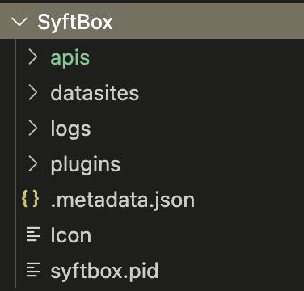
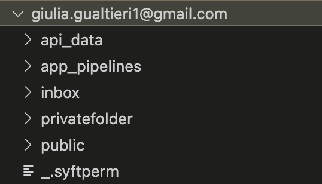

## 📅 Date
**28 November 2024**

## 📰 Resource
[SyftBox](https://syftbox-documentation.openmined.org/) library.

## 🔖 My Learning

Today, I dove into more practical federated learning solutions, attending another Hackaton with the [OpenMined](https://openmined.org) Team. 

The goal of today's hackaton was to explore the capabilities of the [SyftBox](https://syftbox-documentation.openmined.org/) library, as a first proptotype of a federated learning platform.

If you missed the introduction of the library, what is it, how to use it and how to install it, you can find it [here](../day8/day8.md).

### SyftBox's Structure

SyftBox interacts with specific files and directories on your computer:
- The configuration file (located at `~/.syftbox/config.json`)
- The sync directory (selected during installation, typically located at `~/SyftBox` or `~/Desktop/SyftBox`) (`~` refers to your User Home Directory).


The configuration file is primarily used by the SyftBox client and contains information essential for syncing your Datasite with the Syft network.

The sync directory, which represents your Datasite, has a more organized structure:
```bash
SyftBox
├── apis
│   └── ...
├── datasites
│   └── ...
├── logs
│   └── ...
└── plugins
    └── ...
```


The sync directory consists of four main subdirectories:
- `apis`: This directory houses all your SyftBox APIs , which are the core components for interacting with and processing data within the SyftBox ecosystem.
- `datasites`: This directory contains synced data from other clients connected to the Syft network. Each datasite is uniquely identified by the email address of the corresponding network user, ensuring proper organization and access control.
- `logs`: SyftBox stores all log files in this directory, which can be invaluable for troubleshooting and monitoring the system's behavior.
- `plugins`: This directory is designed to host any additional plugins or extensions that enhance the functionality of SyftBox, allowing for customization and extensibility of the platform.

Below the screenshot of my datasite, how it's structured.  




### SyftBox's APIs
In essence, a SyftBox API is a script designed to interact with your own data and/or data synced from other datasites on your machine. These APIs form the backbone of the SyftBox ecosystem, enabling users to process, analyze, and manipulate data in a privacy-preserving manner.
Installing a SyftBox API

Installing a SyftBox API is a straightforward process. Simply drag the API folder into your apis directory, and you're done! The SyftBox client automatically checks for new APIs every 10 seconds and executes them without any further intervention. This seamless installation process ensures that users can quickly and easily expand the functionality of their SyftBox setup.
Creating a SyftBox API

Creating a new SyftBox API is equally simple. The main requirement is to organize your API into a folder containing a `run.sh` script. This script holds the instructions for running the SyftBox API. While SyftBox provides a Python SDK to aid developers in creating APIs using Python, the platform does not impose any limitations on the programming language used. As long as the necessary commands can be invoked from the main `run.sh` file, the API can be written in any language of your choice.

A typical template for a Python-based SyftBox API includes two key files:
- `run.sh`: This script contains the instructions to set up the environment and execute the main Python script.
- `main.py`: This file holds the actual Python code for the API, utilizing the SyftBox Python SDK to interact with the platform and data.

### What's next?
- The **Ring APP**! 🎉

## 📮 Post 

[📘 LinkedIn Post](https://www.linkedin.com/posts/giuliagualtieri_30daysofflcode-activity-7267971766772191232-1nUO?utm_source=share&utm_medium=member_desktop)

------
The _**Federated Learning Term of the Day**_ is **Datasite**.
> [!NOTE]
> A **Datasite** in the context of SyftBox refers to the local environment or node that stores and manages data within the federated learning system.
